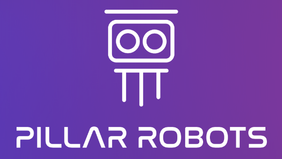
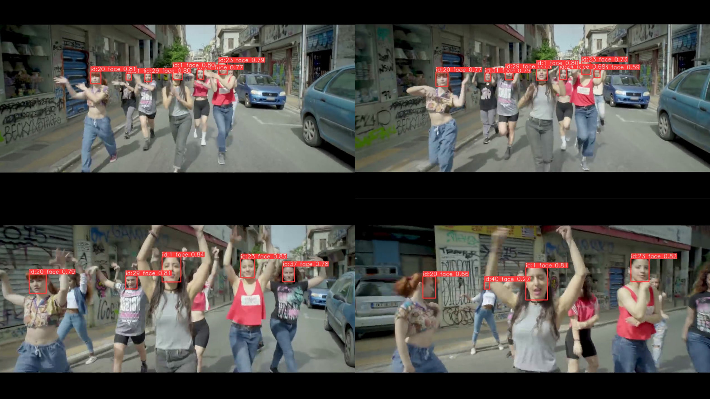

<div align="center">

# Facetracker for PILLAR-Robots 

<a href="https://pillar-robots.eu"> </a>

</div>


This package provides ROS integration for real-time face tracking used in the [PILLAR-Robots project](https://pillar-robots.eu) by [ARC](https://www.athenarc.gr). This package includes a ROS node for publishing face tracking data from video streams and a standalone demo for users who prefer not to use ROS.

<p align="center"> 

</p>
<p align="center">Example output from the face tracker.</p>


## Prerequisites

- ROS Noetic (other versions may require adjustments) if you want to use the ROS node
- Python 3.x
- OpenCV
- [ultralytics](https://github.com/ultralytics/ultralytics)


Instructions for install ROS Noetic can be found on the [official ROS installation page](http://wiki.ros.org/noetic/Installation).

## Installation


1. **Create or navigate to your ROS workspace**:

    ```bash
    cd ~/my_ros_workspace/src
    ```

2. **Clone the package into your workspace's `src` directory** :

    ```bash
    git clone https://github.com/filby89/facetracker_pillar
    ```

3. **Build the package**:

    Navigate back to the root of your workspace and build it:

    ```bash
    cd ~/my_ros_workspace
    catkin_make
    ```

4. **Source your workspace**:

    Each new terminal session requires sourcing your workspace:

    ```bash
    source ~/my_ros_workspace/devel/setup.bash
    ```

## Usage

### Running the ROS Node

1. **Launch the `FaceTrackerNode`**:

    ```bash
    roslaunch facetracker_pillar facetracker.launch
    ```
    
    The node subscribes to a video stream and publishes face tracking data to the `/face_tracker` topic.

## Running the Standalone Demo

If you prefer not to use ROS, a standalone `demo.py` is included. This script demonstrates basic face tracking functionality without the need for ROS infrastructure.

1. **Navigate to the script's directory**:

    ```bash
    cd ~/my_ros_workspace/src/facetracker_pillar
    ```

2. **Run the demo**:

    ```bash
    python scripts/demo.py
    ```


## Acknowledgements
We acknowledge the following repositories for providing the face detection and tracking models:
* https://github.com/akanametov/yolov8-face
* https://github.com/ultralytics/ultralytics
